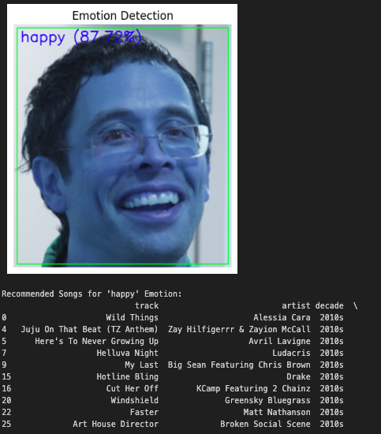
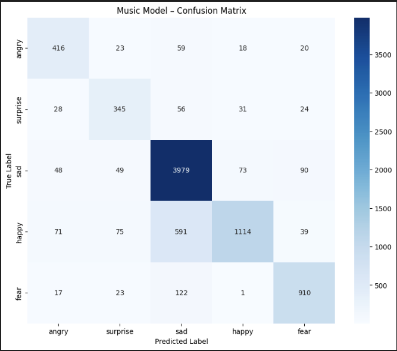
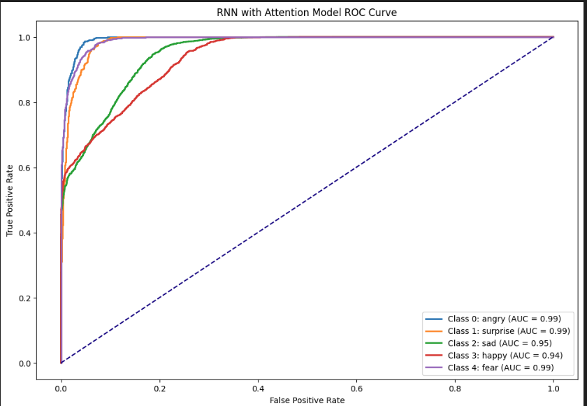
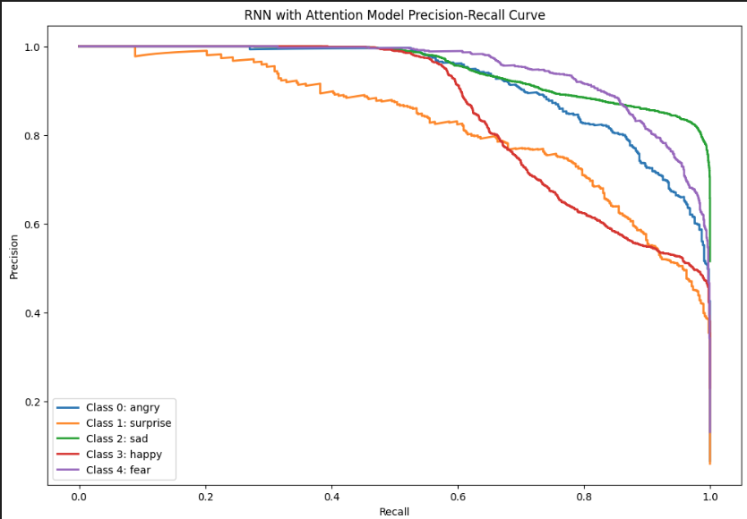

# DSUA-301-Final Project-Moodify
Most music recommendation systems today rely heavily on user history or listening habits, lacking real-time interaction based on users' current mood or context. 
This project combines real-time emotion detection with music recommendation to create a personalized and context-aware user experience.
We trained emotion detection models on the FER2013 dataset with fine-tuned CNN, VGG16, ResNet and paired them with a music recommendation model based on CNN and RNN-attention architectures.
The system can predict emotions like angry, sad, happy, surprise, and fear, then recommend 10 songs tailored to the detected emotion.

 ## Environment setup
 ### 1. requirements
 - Python >= 3.8
 - Install dependencies with pip:
   
 `pip install -r requirements.txt`

 
 ### 2. Dataset setup
 Download the dataset from [FER2013 Dataset](https://www.kaggle.com/datasets/msambare/fer2013)
 
 Another dataset is customed [music_moods_dataset.csv](./music_moods_dataset.csv)
 

## Execution
### 1. Train Emotion Detection Models

### 2. Predict Emotion and Recommend Songs

### 3. Visualize Results 

#### Expected output
with taking a selfie like this

 You can get a picture with emotional label and confidence and the 10 songs recomended to you.
 

 ## Results
 
 ### 1. Emotion Detection
 Due to the imbalance among classes of the FER2013FER2013 dataset, we made data augmentation by using ImageDataGenerator to generate more examples of small-class images and assigning larger weights to underrepresented classes during training.
 Among fine-tuned CNN, ResNet and VGG16, CNN with hypeband parameter search have the best performance and generalization ability.
 #### CNN Classification Report

| Class      | Precision | Recall | F1-Score | Support |
|------------|-----------|--------|----------|---------|
| angry      | 0.65      | 0.55   | 0.59     | 958     |
| surprise   | 0.82      | 0.69   | 0.75     | 831     |
| sad        | 0.54      | 0.74   | 0.63     | 1247    |
| happy      | 0.83      | 0.93   | 0.87     | 1774    |
| fear       | 0.57      | 0.36   | 0.44     | 1024    |

| Metric          | Value |
|------------------|-------|
| **Accuracy**     | 0.69  |
| **Macro Avg**    | Precision: 0.68, Recall: 0.65, F1-Score: 0.66 |
| **Weighted Avg** | Precision: 0.69, Recall: 0.69, F1-Score: 0.68 |

 
 

 

 ### 2.Music Recommendation
We initially implemented a CNN model for the music-emotion learning task and later enhanced it to an RNN with attention mechanism. This improvement yielded promising performance, significantly boosting the model's ability to detect smaller categories such as angry, fear, and surprise.
 ## Report for CNN

| Metric          | Precision | Recall | F1-Score | Support |
|------------------|-----------|--------|----------|---------|
| **Accuracy**     |           |        | 0.82     | 8222    |
| **Macro Avg**    | 0.79      | 0.77   | 0.77     | 8222    |
| **Weighted Avg** | 0.83      | 0.82   | 0.82     | 8222    |

 

 | ROC_curve_for_RNN_with_attention        | PR_curve_for_RNN_with_attention       |
|----------------|----------------|
|  |  |

 ## Future Work

 ## Contributors
 Alexandra Przysucha (ajp9010@nyu.edu)
 Andrea Cardiel (alc9588@nyu.edu)
 Yuhong Zhang (yz9134@nyu.edu)
 
 
