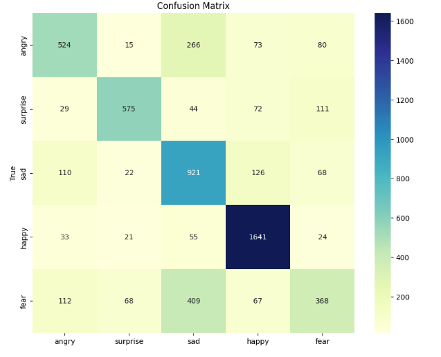

# DSUA-301-Final Project-Moodify
Most music recommendation systems today rely heavily on user history or listening habits, lacking real-time interaction based on users' current mood or context. 
This project combines real-time emotion detection with music recommendation to create a personalized and context-aware user experience.
We trained emotion detection models on the FER2013 dataset with finetuned  CNN, VGG16, ResNet and paired them with a music recommendation model based on CNN and RNN-attention architectures.
The system can predict emotions like angry, sad, happy, surprise, and fear, then recommend 10 songs tailored to the detected emotion.

 ## Environment setup
 ### 1.requirements
 - Python >= 3.8
 - Install dependencies with pip:
   
 `pip install -r requirements.txt`

 
 ### 2.dataset setup
 Download the dataset from [FER2013 Dataset](https://www.kaggle.com/datasets/msambare/fer2013)
 
 Another dataset is customed [music_moods_dataset.csv](./music_moods_dataset.csv)
 

 

 ## Results
 
 ### 1.Emotion Detection
 Due to the imbalance among class of the FER2013FER2013 dataset, we made data augmentation by using ImageDataGenerator to generate more example of small-class images and assigning larger weights to underrepresented classes during training.
 Among finetuned CNN, ResNet and VGG16, CNN with hypeband parameter search has the best performance and generelization ability.
 #### CNN Classification Report

| Class      | Precision | Recall | F1-Score | Support |
|------------|-----------|--------|----------|---------|
| angry      | 0.65      | 0.55   | 0.59     | 958     |
| surprise   | 0.82      | 0.69   | 0.75     | 831     |
| sad        | 0.54      | 0.74   | 0.63     | 1247    |
| happy      | 0.83      | 0.93   | 0.87     | 1774    |
| fear       | 0.57      | 0.36   | 0.44     | 1024    |

| Metric          | Value |
|------------------|-------|
| **Accuracy**     | 0.69  |
| **Macro Avg**    | Precision: 0.68, Recall: 0.65, F1-Score: 0.66 |
| **Weighted Avg** | Precision: 0.69, Recall: 0.69, F1-Score: 0.68 |

 
 
 

 ### 2.Music Recommendation

 ## Future Work

 ## Contributors
 
 
